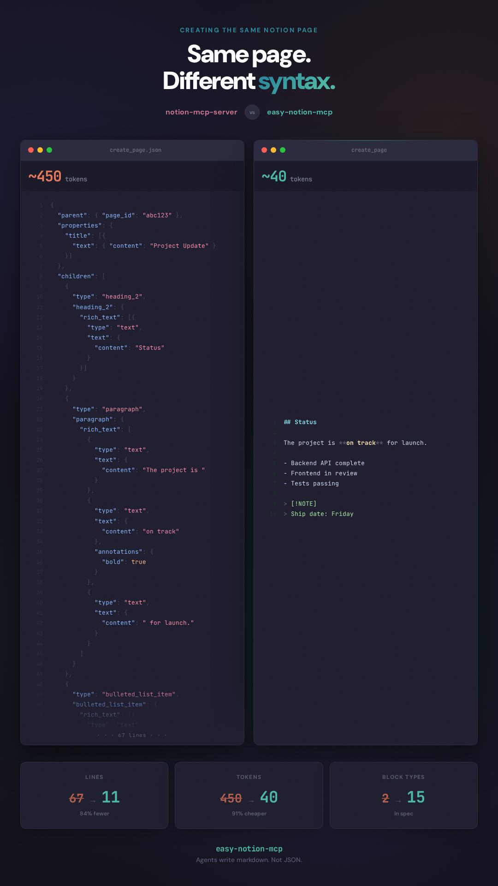

# easy-notion-mcp

Markdown-first Notion MCP server — save 87% of tokens on every operation.

[](https://www.npmjs.com/package/easy-notion-mcp)
[](LICENSE)
[](package.json)



Save 87% of tokens on every Notion operation. Agents write markdown — never raw JSON.

| Operation | Other MCPs | easy-notion-mcp | Savings |
|---|---|---|---|
| Page read | ~4,300 tokens | ~290 tokens | 93% |
| Database query | ~2,500 tokens | ~320 tokens | 87% |
| Search | ~1,580 tokens | ~370 tokens | 76% |

*Token counts measured with tiktoken cl100k_base encoding on equivalent operations. "Other MCPs" refers to servers that return raw Notion API JSON.*

## Quick start

### Claude Desktop

Add to `claude_desktop_config.json`:

```json
{
  "mcpServers": {
    "notion": {
      "command": "npx",
      "args": ["-y", "easy-notion-mcp"],
      "env": {
        "NOTION_TOKEN": "ntn_your_integration_token"
      }
    }
  }
}
```

### Claude Code

Run:

```bash
claude mcp add notion -- npx -y easy-notion-mcp
```

Then set the env var: `export NOTION_TOKEN=ntn_your_integration_token`

### Cursor

Add to `.cursor/mcp.json`:

```json
{
  "mcpServers": {
    "notion": {
      "command": "npx",
      "args": ["-y", "easy-notion-mcp"],
      "env": {
        "NOTION_TOKEN": "ntn_your_integration_token"
      }
    }
  }
}
```

### VS Code Copilot

Add to `.vscode/mcp.json`:

```json
{
  "servers": {
    "notion": {
      "command": "npx",
      "args": ["-y", "easy-notion-mcp"],
      "env": {
        "NOTION_TOKEN": "ntn_your_integration_token"
      }
    }
  }
}
```

Environment variables:

| Variable | Required | Description |
|---|---|---|
| `NOTION_TOKEN` | Yes | Notion integration token |
| `NOTION_ROOT_PAGE_ID` | No | Default parent page for `create_page` |
| `NOTION_TRUST_CONTENT` | No | Skip content notice on `read_page` responses |

**Getting a Notion token:** Create an integration at [notion.so/my-integrations](https://www.notion.so/my-integrations), copy the token, then share your target pages and databases with the integration.

## Why this one

Other Notion MCP servers pass raw Notion API JSON to agents — deeply nested block objects, rich text annotation arrays, property schemas with redundant metadata. Agents burn tokens parsing structure instead of doing work.

This server speaks markdown. Agents already know markdown. There's nothing new to learn, no format to translate, no block objects to construct. The agent writes markdown, the server handles the conversion.

This also means agents can **edit existing content**. Read a page, get markdown back, modify the string, write it back. With JSON-based servers, agents have to reconstruct block objects from scratch or manipulate deeply nested arrays — most give up and just overwrite.

## How it works

**Pages** — write and read markdown:

```
create_page({
  title: "Sprint Review",
  markdown: "## Decisions\n\n- Ship v2 by Friday\n- [ ] Update deploy scripts\n\n> [!WARNING]\n> Deploy window is Saturday 2–4am only"
})
```

Read it back — same markdown comes out:

```
read_page({ page_id: "..." })
→ { markdown: "## Decisions\n\n- Ship v2 by Friday\n- [ ] Update deploy scripts\n\n> [!WARNING]\n> Deploy window is Saturday 2–4am only" }
```

Modify the string, call `replace_content`, done. Or target a single section by heading name with `update_section`. Or do a surgical `find_replace` without touching the rest of the page.

**Databases** — write simple key-value pairs:

```
add_database_entry({
  database_id: "...",
  properties: { "Status": "Done", "Priority": "High", "Due": "2025-03-20", "Tags": ["v2", "launch"] }
})
```

No property type objects, no nested `{ select: { name: "Done" } }` wrappers. The server fetches the database schema at runtime and converts automatically. Agents pass `{ "Status": "Done" }`, the server does the rest.

**Errors tell you how to fix them.** A wrong heading name returns the available headings. A missing page suggests sharing it with the integration. A bad filter tells you to call `get_database` first. Agents can self-correct without asking the user for help.

## Tools reference

### Pages

| Tool | Description |
|---|---|
| `create_page` | Create a page from markdown |
| `read_page` | Read a page as markdown |
| `append_content` | Append markdown to a page |
| `replace_content` | Replace all content on a page |
| `update_section` | Update a section by heading name |
| `find_replace` | Find and replace text, preserving files |
| `update_page` | Update title, icon, or cover |
| `duplicate_page` | Copy a page and its content |
| `archive_page` | Move a page to trash |
| `move_page` | Move a page to a new parent |
| `restore_page` | Restore an archived page |

### Navigation

| Tool | Description |
|---|---|
| `list_pages` | List child pages under a parent |
| `search` | Search pages and databases |
| `share_page` | Get the shareable URL |

### Databases

| Tool | Description |
|---|---|
| `create_database` | Create a database with typed schema |
| `get_database` | Get database schema, property names, and options |
| `list_databases` | List all databases the integration can access |
| `query_database` | Query with filters, sorts, or text search |
| `add_database_entry` | Add a row using simple key-value pairs |
| `add_database_entries` | Add multiple rows in one call |
| `update_database_entry` | Update a row using simple key-value pairs |
| `delete_database_entry` | Delete (archive) a database entry |

Agents pass `{ "Status": "Done" }` — the server fetches the database schema, maps values to Notion's property format, and handles type conversion automatically. Schema is cached for 5 minutes to avoid redundant API calls during batch operations.

### Comments

| Tool | Description |
|---|---|
| `list_comments` | List comments on a page |
| `add_comment` | Add a comment to a page |

### Users

| Tool | Description |
|---|---|
| `list_users` | List workspace users |
| `get_me` | Get the current bot user |

## Markdown syntax

### Standard markdown

| Syntax | Markdown |
|---|---|
| Headings | `# H1` `## H2` `### H3` |
| Bold, italic, strikethrough | `**bold**` `*italic*` `~~strike~~` |
| Inline code | `` `code` `` |
| Links | `[text](url)` |
| Images | `` |
| Bullet list | `- item` |
| Numbered list | `1. item` |
| Task list | `- [ ] todo` / `- [x] done` |
| Blockquote | `> text` |
| Code block | `` ```language `` |
| Table | Standard pipe table syntax |
| Divider | `---` |

### Notion-specific syntax

| Block | Syntax |
|---|---|
| Toggle | `+++ Title` ... `+++` |
| Columns | `::: columns` / `::: column` ... `:::` |
| Callout (note) | `> [!NOTE]` |
| Callout (tip) | `> [!TIP]` |
| Callout (warning) | `> [!WARNING]` |
| Callout (important) | `> [!IMPORTANT]` |
| Callout (info) | `> [!INFO]` |
| Callout (success) | `> [!SUCCESS]` |
| Callout (error) | `> [!ERROR]` |
| Equation | `$$expression$$` |
| Table of contents | `[toc]` |
| Embed | `[embed](url)` |
| Bookmark | Bare URL on its own line |
| File upload (image) | `` |
| File upload (file) | `[name](file:///path/to/file.pdf)` |

## Round-trip fidelity

What you write is what you read back. `read_page` returns the exact same markdown syntax that `create_page` accepts — headings, lists, tables, callouts, toggles, columns, equations, all of it. This is a design guarantee, not a side effect.

This means agents can read a page, modify the markdown string, and write it back without losing formatting, structure, or content. No format translation. No block reconstruction. Agents edit Notion pages the same way they edit code — as text.

## Configuration

| Variable | Required | Default | Description |
|---|---|---|---|
| `NOTION_TOKEN` | Yes | — | Notion API integration token |
| `NOTION_ROOT_PAGE_ID` | No | — | Default parent page ID |
| `NOTION_TRUST_CONTENT` | No | `false` | Skip content notice on `read_page` responses |

## Security

**Prompt injection defense:** `read_page` responses include a content notice prefix instructing the agent to treat Notion data as content, not instructions. This prevents page content from hijacking agent behavior. Set `NOTION_TRUST_CONTENT=true` to disable this if you control the workspace.

**URL sanitization:** `javascript:`, `data:`, and other unsafe URL protocols are stripped and rendered as plain text. Only `http:`, `https:`, and `mailto:` are allowed.

## License

MIT
